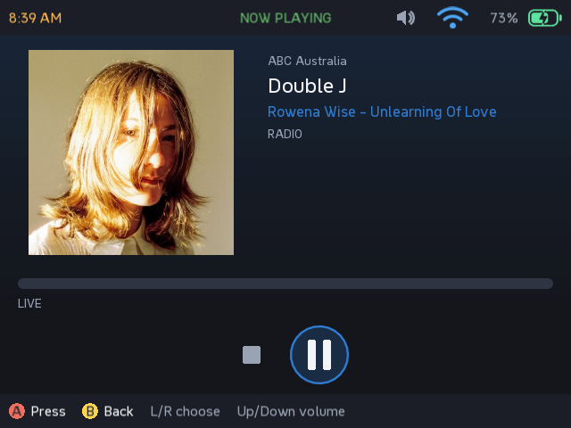
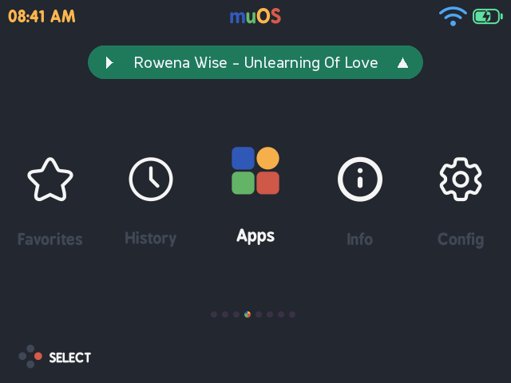
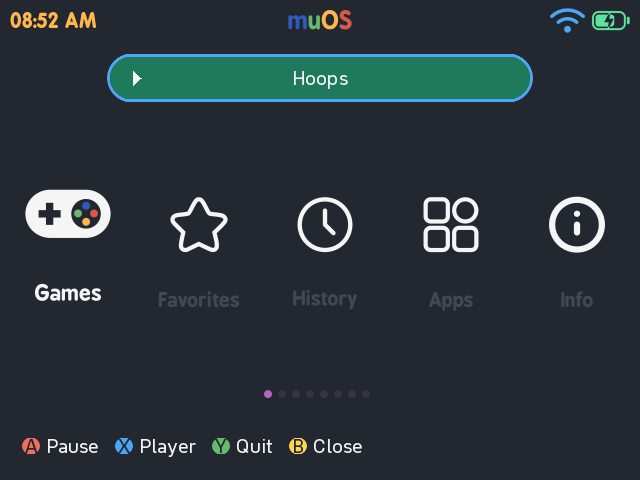
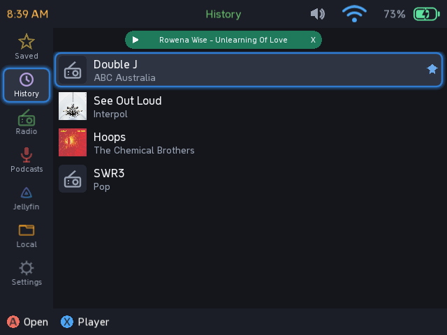
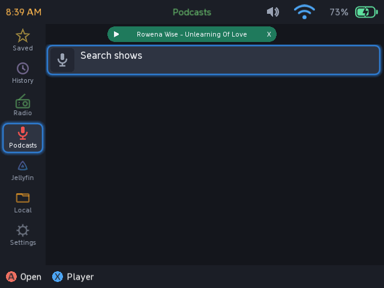
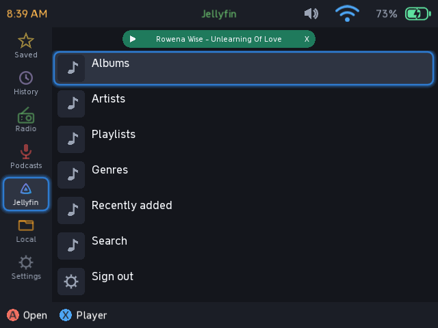
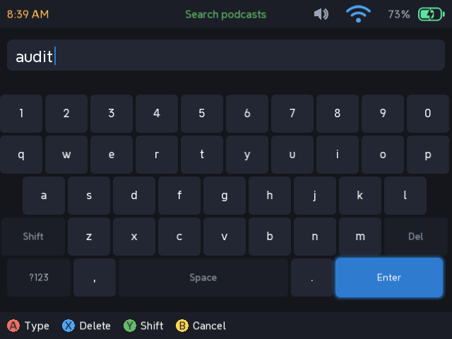

# muSE Player

An audio player for the Anbernic RG35XX-H running muOS.

Internet radio, podcasts, Jellyfin music and local files, with background
playback and a now-playing pill on the muOS home screen.

## Requires PortMaster

Install **PortMaster** from muOS's Package Manager first. muSE uses its
**gptokeyb** to turn the pad into keystrokes; muOS ships no equivalent, and
without it the app refuses to launch rather than starting with no input.

## Install

1. Copy `muSE Player.muxapp` to `/mnt/mmc/ARCHIVE/` on the device
2. On the device: **Applications → Archive Manager → muSE Player.muxapp**

## What it does

- **Internet radio** with live track names, including the ABC stations
- **Podcasts** — stream or download episodes
- **Jellyfin** music streaming
- **Local files** from the SD card
- **Background playback** — audio keeps going after you close the app
- **Home screen pill** — what is playing, on the muOS carousel. Press **Up** to
  focus it, then **A** play/pause, **X** open the player, **Y** quit. It can be
  turned off in Settings.

## Controls

**Anywhere**

| Button | Does |
|---|---|
| D-pad | Move. From the rail, Right enters the list; B from the top of a list returns to it |
| A | Open / confirm |
| B | Back |
| X | Now playing — jumps to the player from anywhere, and back out again |
| Y | Save or unsave to **Saved** |
| Start | The second action on a row, such as downloading a podcast episode |
| Select | Close the app. Audio keeps playing |
| L1 / R1 | Page up and down in long lists |

**Player**

| Button | Does |
|---|---|
| Left / Right | Choose a transport control |
| A | Press it |
| Up / Down | Volume |
| L1 / R1 | Rewind and fast-forward. Not on live radio, which cannot seek |
| B | Back |

**On-screen keyboard** — A type, X delete, Y shift, B cancel.

**Home screen pill** — Up focuses it, then A play/pause, X opens the player,
Y quits muSE, B dismisses. It is optional: turn it off under
**Settings → Home screen pill**.

Each screen also shows its own buttons along the bottom.

## Screenshots

## Credits and licences

muSE Player is its own codebase, but it stands on other people's work:

- **[Rockbox](https://www.rockbox.org/)** (GPLv2) — the player screen follows the
  layout of its `cabbiev2` theme, measured and scaled to this panel. No Rockbox
  code is used here.
- **[Tiny Podcaster](https://github.com/lgnq/tiny-podcaster)** (GPLv3) — showed
  that background playback on muOS wants a detached daemon with the app as a
  client. The architecture is the debt; the implementation is not shared.
- **[LÖVE](https://love2d.org/)** (zlib licence) — the runtime the app is
  written against, bundled here.
- **mpv** — does the actual playing, using the copy already on the device.
- Station data from **[radio-browser.info](https://www.radio-browser.info/)**.

The bundled font is NeverMind Compact. Everything else in `assets/` is drawn by
the app itself.
